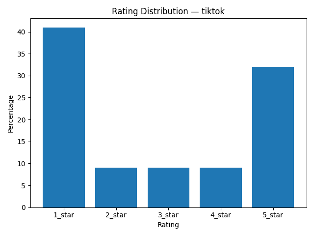

# Review Insights Report — tiktok

_Generated at: 2025-12-25T16:18:45_

## Metrics

- **Average rating:** 2.82
- **Total reviews:** 100

## Sentiment Distribution

- **Positive**: 50
- **Neutral**: 17
- **Negative**: 33

## Key Insights

### 1. Account Access
**Summary:** Customers encounter difficulties with accessing their accounts, facing bans, or logging in.
- **Affected problem reports:** 4 / 15 (27%)
**Evidence:**
- Worst social media app ever let me tell u why So I made an account and I started posting videos and I play this game called “steal a Brainrot”and I’m looking to trade and I traded and then this guy named djay_sab started being racist saying that slaves killed people like me (Latinos) and then I say one mean word ONE MEAN WORD and then I got my account banned from messaging,and posting an my account is going to be deleted.WORST APP EVER DO NOT DOWNLOAD
- Banned account Had my account for 6 plus years.
- The app SUCKS Hello I got this app and it was going good at the start until it said I was “too young” so it said it was gonna BAN ME and I made so many friends and followers and many fun moments that made the app feel special so I tryed to defend myself but the stupid stuff didnt work so now I can’t watch TikTok (the go to app for watching videos for me)and now I’m here and I still dunno know why they did this earlier so now I’m stuck with YouTube and brainrot kids (I also made edits that well are now much are just a waste) SO DONT GET TIKTOK
- Kinda Okay I kinda like TikTok but they be letting people ban other people for no reason, i literally commented on a video, showing a man putting a shoe on another man but there was nothing inappropriate about that, I’ve seen people with memes that are NAKED and TikTok is just gonna delete MY comment instead of theres
**Recommendation:** Enhance the clarity of account-related actions and implement more transparent recovery and appeal procedures.

### 2. Ads Monetization
**Summary:** Users complain about an overabundance of advertisements or aggressive monetization strategies.
- **Affected problem reports:** 3 / 15 (20%)
**Evidence:**
- TIKTOK IS NOT TIKTOK ANYMORE More ads than content.
- And now you’ve updated so copycat Threads.
- Love hate It’s mostly ads for dumb mobile games, AI garbage, useless Lemon 8 notifications that you can’t turn off and a blocking function that doesn’t work.
**Recommendation:** Evaluate ad frequency and targeting policies to minimize interference with the primary user experience.

### 3. Content Upload Issues
**Summary:** Problems during video or picture uploads.
- **Affected problem reports:** 2 / 15 (13%)
**Evidence:**
- Static Recently trying to upload, pics or videos will have obnoxious static sounds and won't upload at all saying failed
- problem about the videos when I post something or a lot of pictures they don’t separate, it’s turn into a video and not pictures and I wanted to be a picture I can browse on, but I can’t decide which one I wanna do pls fix this problem it’s so bad
**Recommendation:** Investigate and resolve technical issues causing static sounds, failed uploads, and misinterpreted content types.

### 4. Usability
**Summary:** There are issues with how users interact with the application, affecting overall usability.
- **Affected problem reports:** 1 / 15 (7%)
**Evidence:**
- Social media has lost the plot quicker than Netflix.
**Recommendation:** Reassess recent design modifications through usability testing to identify and address any points of friction in typical user journeys.

### 5. Content Moderation
**Summary:** Inadequate handling of sensitive content.
- **Affected problem reports:** 1 / 15 (7%)
**Evidence:**
- They turn a blind eye to black issues and racism.
**Recommendation:** Implement stricter moderation policies to address racial issues and ensure a safe space for discussions on sensitive topics.

### 6. Feature Usability
**Summary:** Difficulty in using the streaks feature.
- **Affected problem reports:** 1 / 15 (7%)
**Evidence:**
- No streaks I cannot streaks friend and I want STREAKS
**Recommendation:** Enhance user interface design to make it easier for users to create and share streaks with friends.

### 7. Spam And Notifications
**Summary:** Unwanted spam messages.
- **Affected problem reports:** 1 / 15 (7%)
**Evidence:**
- Spam So I just sign up for it and already I’m getting spam text.
**Recommendation:** Improve anti-spam measures to prevent unauthorized notifications from interfering with user experience.

## Negative Keywords

- **tiktok**: 18
- **people**: 11
- **account**: 9
- **hate**: 7
- **yall**: 7
- **banned**: 6
- **content**: 6
- **videos**: 6
- **like**: 5
- **stupid**: 5

## Visualizations

### Rating Distribution

### Sentiment Distribution

