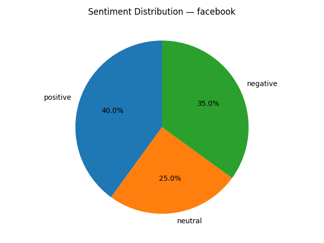

# Review Insights Report — facebook

_Generated at: 2025-12-25T13:10:35_

## Metrics

- **Average rating:** 2.74
- **Total reviews:** 100

## Sentiment Distribution

- **Positive**: 40
- **Neutral**: 25
- **Negative**: 35

## Key Insights

### 1. Account Access
**Summary:** Customers encounter difficulties with account management, restrictions, or login processes.
- **Affected problem reports:** 4 / 14 (28%)
**Evidence:**
- Meta’s moderation is notoriously selective: inflammatory, antagonistic content often stays up unchecked, while honest, candid responses defending yourself get flagged as “violations,” leading to arbitrary restrictions or bans.
- And forget about their false advertisement that if you pay $149 a month for meta verified business and $15 a month for personal accounts that you will have next level customer service and access to a human.
- The fact that I had a benign grandma account with cats, kids, and a 5 star business get shut down is absurd.
- Garbage marketplace restrictions So stupid restriction on how many chats per day is garbage how do they expect people to sell their products or buy anything when you’re restricted to like a few chats a day worthless app deleted and went to mercari and other marketplaces waste of time and stress
**Recommendation:** Enhance the clarity of account-related notifications and establish more effective recovery and appeal procedures.

### 2. Ads Monetization
**Summary:** Users express dissatisfaction with intrusive advertisements or aggressive revenue strategies.
- **Affected problem reports:** 3 / 14 (21%)
**Evidence:**
- Disappointed To many ads and not showing friends comments
- Too many fake ads too many ads that are for companies that are dis reputable and not real too much political drama on both sides.
- Too many ads Not enough friend post
**Recommendation:** Evaluate ad frequency and targeting to minimize disruptions to regular user activities.

### 3. Usability
**Summary:** There are issues that affect how users interact with the application.
- **Affected problem reports:** 2 / 14 (14%)
**Evidence:**
- Worst of all, it’s profoundly detrimental to children’s mental health—studies link heavy use to increased anxiety, depression, and body image issues due to endless comparison, cyberbullying, and addictive design.
- My business pages intellectual property, advertising campaigns, client and professional network built over years and years of hardworking— GONE!
**Recommendation:** Reassess recent design modifications through usability testing to ensure smooth navigation in typical user journeys.

### 4. Advertising
**Summary:** Ineffective and misleading advertisements.
- **Affected problem reports:** 2 / 14 (14%)
**Evidence:**
- I have spent thousand in advertising for my reputable business.
- Just use it for marketplace - which is getting weirder with odd AI adds that are click tricks.
**Recommendation:** Facebook should enhance its algorithm to ensure that ads are more relevant and not misleading.

### 5. Marketplace
**Summary:** Decline of the Marketplace feature and user dissatisfaction.
- **Affected problem reports:** 2 / 14 (14%)
**Evidence:**
- Just use it for marketplace - which is getting weirder with odd AI adds that are click tricks.
- With all of the adds and now the loss of marketplace I may just be done with Facebook all together.
**Recommendation:** Facebook should reinvest in improving the functionality and attractiveness of the Marketplace to retain users.

### 6. Customer Support
**Summary:** Customers complain about inadequate or hard-to-reach support services.
- **Affected problem reports:** 1 / 14 (7%)
**Evidence:**
- And forget about their false advertisement that if you pay $149 a month for meta verified business and $15 a month for personal accounts that you will have next level customer service and access to a human.
**Recommendation:** Boost response times and provide clear escalation protocols, particularly for business and verified accounts.

### 7. User Experience
**Summary:** Frequent errors and interruptions in reading posts.
- **Affected problem reports:** 1 / 14 (7%)
**Evidence:**
- "Something went wrong" I have notifications for the different sections like marketplace but if I actually try to open up postings, I keep getting the same error message with no fix.
**Recommendation:** Facebook should improve its error handling mechanisms to prevent users from encountering 'Something went wrong' messages frequently.

## Negative Keywords

- **facebook**: 23
- **friends**: 8
- **many**: 8
- **account**: 7
- **post**: 6
- **getting**: 6
- **business**: 6
- **people**: 6
- **marketplace**: 6
- **something**: 6

## Visualizations

### Rating Distribution

### Sentiment Distribution

