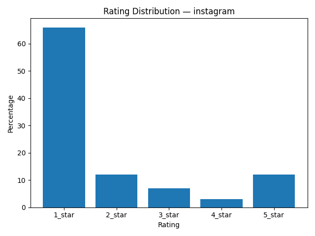
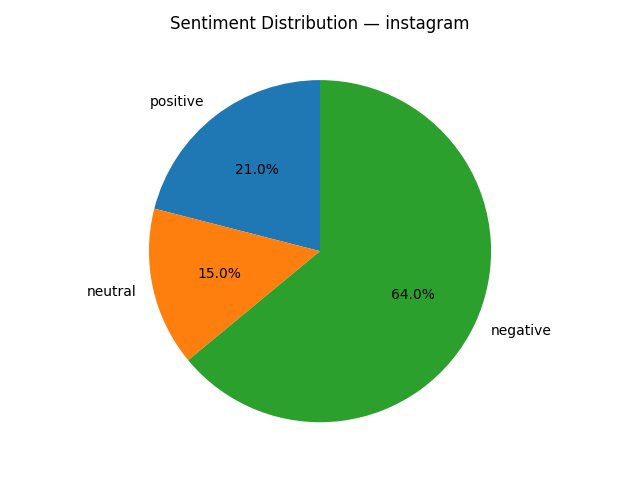

# Review Insights Report — instagram

_Generated at: 2025-12-25T13:18:01_

## Metrics

- **Average rating:** 1.83
- **Total reviews:** 100

## Sentiment Distribution

- **Positive**: 21
- **Neutral**: 15
- **Negative**: 64

## Key Insights

### 1. Account Access
**Summary:** Users face problems related to account access, bans, or login.
- **Affected problem reports:** 7 / 15 (47%)
**Evidence:**
- Insta accounts are being deleted or suspended way too easily now.
- Girlfriend blocked me Tf is this??
- A review abt my instagram account lilmirr____ I was banned on my instagram account for no reason permeantly banned fo no reason i didnt post or do anything yall are just banning people for nothing i had stuff i really had on that account i could never get back beacause im getting banned on evey account
- Communication And it’s very hard to get in contact with anyone when this problem occurs so you just have to wait 2 days when they give my account back.
- hate… I hate this app cause why on my new account I can comment on story’s but on my Older account I CANT and why did you guys take away my Lagos and Tokyo 😡😡😡😡I used to love this app NOW I HATE IT I only keep it for friends and aesthetics..and also WE NEED TO BE ABLE TO CHOOSE OUR OWN COLOR FOR OUR NOTES😡AND STORYS I hate that green and that Sunset color for our stories AND I ALSO HATE THOSE LIMITED COLORS WE HAVE for our notes LET US CHOOSE OUR OWN COLORSSSS😡😡😡
**Recommendation:** Improve transparency of account actions and provide clearer recovery and appeal mechanisms.

### 2. Usability
**Summary:** Users experience usability or interaction issues with the app.
- **Affected problem reports:** 6 / 15 (40%)
**Evidence:**
- Insta updates are annoying and there are way too many restrictions now.
- new UI sucks bad bad bad plesse let people just choose the locations of their tabs/icons
- IG is trying to hard to be like TikTok which is inevitably going to lead to less and less users.
- Communication And it’s very hard to get in contact with anyone when this problem occurs so you just have to wait 2 days when they give my account back.
- new update is awful By swapping the DMs, reels and search sections and removing the posting button from the middle, you have made this app very unintuitive.
**Recommendation:** Review recent UX changes and validate them through usability testing to reduce friction in common user flows.

### 3. Stability
**Summary:** Users report stability issues such as crashes, freezes, or malfunctioning features.
- **Affected problem reports:** 3 / 15 (20%)
**Evidence:**
- hate… I hate this app cause why on my new account I can comment on story’s but on my Older account I CANT and why did you guys take away my Lagos and Tokyo 😡😡😡😡I used to love this app NOW I HATE IT I only keep it for friends and aesthetics..and also WE NEED TO BE ABLE TO CHOOSE OUR OWN COLOR FOR OUR NOTES😡AND STORYS I hate that green and that Sunset color for our stories AND I ALSO HATE THOSE LIMITED COLORS WE HAVE for our notes LET US CHOOSE OUR OWN COLORSSSS😡😡😡
- inaccurate flagging their “technology” is so inaccurate with detecting content that goes against the rules.
- SOMETHING IS NOT WORKING my music stops working randomly on my posts.
**Recommendation:** Analyze crash logs and performance metrics from recent releases to identify and resolve stability regressions.

### 4. Customer Support
**Summary:** Users report poor or inaccessible customer support.
- **Affected problem reports:** 1 / 15 (7%)
**Evidence:**
- terrible customer support I am verified business and I cannot get in touch with anyone via enhanced support.
**Recommendation:** Improve support responsiveness and ensure clear escalation paths, especially for business and verified accounts.

## Negative Keywords

- **account**: 52
- **instagram**: 24
- **suspended**: 21
- **reason**: 21
- **back**: 20
- **banned**: 17
- **update**: 15
- **accounts**: 14
- **hate**: 12
- **people**: 10

## Visualizations

### Rating Distribution

### Sentiment Distribution

